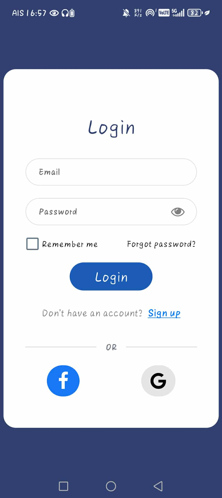
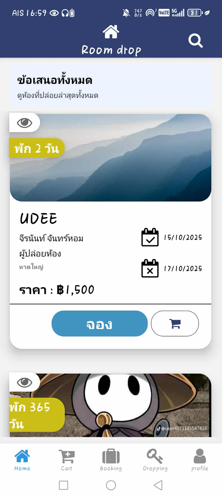
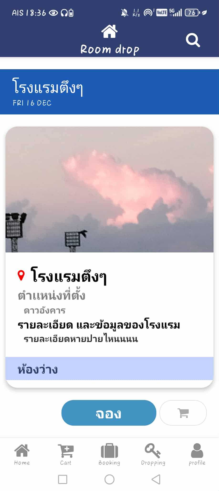

# **RoomDrop 🏨**

แอปพลิเคชันสำหรับจองและปล่อยเช่าห้องพัก ที่สร้างขึ้นด้วย React Native (Expo) และเชื่อมต่อกับ Firebase สำหรับการจัดการข้อมูลและผู้ใช้

## **✨ Screenshots**

*เร็วๆ นี้\! เพิ่มรูปภาพตัวอย่างสวยๆ ของแอปพลิเคชันคุณที่นี่ได้เลย*

| หน้า Login | หน้า Home | หน้ารายละเอียด |
| :---- | :---- | :---- |
|    |    |    |

## **🚀 Features (คุณสมบัติ)**

* **Authentication:** สมัครสมาชิกและล็อกอินด้วย Firebase Authentication  
* **Room Listings:** ดูรายการห้องพักทั้งหมด  
* **Search & Filter:** ค้นหาและกรองห้องพัก  
* **Booking System:** ระบบการจองห้องพัก  
* **Room Management:** เพิ่ม, แก้ไข, และลบห้องพักของตัวเอง  
* **User Profiles:** จัดการข้อมูลส่วนตัวของผู้ใช้

## **🛠️ Tech Stack (เทคโนโลยีที่ใช้)**

* **Framework:** React Native (Expo)  
* **Routing:** Expo Router  
* **Backend & Database:** Firebase (Authentication, Firestore)  
* **UI Library:** React Native Paper  
* **State Management:** Zustand  
* **Language:** TypeScript

## **🏁 Getting Started (การติดตั้งและเริ่มใช้งาน)**

### **สิ่งที่ต้องมีก่อน (Prerequisites)**

* [Node.js](https://nodejs.org/) (เวอร์ชัน 18 ขึ้นไป)  
* [Git](https://git-scm.com/)  
* [Expo Go app](https://expo.dev/go) บนมือถือ iOS หรือ Android

### **การติดตั้ง (Installation)**

1. **Clone the repository:**  
   git clone \[https://github.com/Tanagon492547/room-drop.git\](https://github.com/Tanagon492547/room-drop.git)

2. **Navigate to the project directory:**  
   cd room-drop

3. **Install dependencies:**  
   npm install

4. **Setup Environment Variables:**  
   * สร้างไฟล์ใหม่ที่ root ของโปรเจกต์ชื่อว่า **.env**  
   * คัดลอก "กุญแจ" ต่าง ๆ จากโปรเจกต์ Firebase ของคุณมาใส่ในไฟล์ .env ตามรูปแบบนี้:  
     EXPO\_PUBLIC\_FIREBASE\_API\_KEY="YOUR\_API\_KEY"  
     EXPO\_PUBLIC\_FIREBASE\_AUTH\_DOMAIN="YOUR\_AUTH\_DOMAIN"  
     EXPO\_PUBLIC\_FIREBASE\_PROJECT\_ID="YOUR\_PROJECT\_ID"  
     EXPO\_PUBLIC\_FIREBASE\_STORAGE\_BUCKET="YOUR\_STORAGE\_BUCKET"  
     EXPO\_PUBLIC\_FIREBASE\_MESSAGING\_SENDER\_ID="YOUR\_MESSAGING\_SENDER\_ID"  
     EXPO\_PUBLIC\_FIREBASE\_APP\_ID="YOUR\_APP\_ID"

5. **Run the application:**  
   npx expo start

   จากนั้นสแกน QR Code ด้วยแอป Expo Go บนมือถือของคุณ